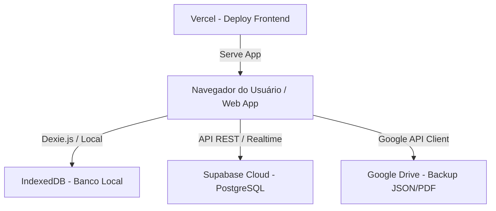

# Guia Técnico de Arquitetura e Recuperação de Pane — GCAC Principal

Este documento serve como guia de orientação para técnicos em T.I. ou desenvolvedores em caso de panes sistêmicas, migrações de servidor, ou necessidade de manutenção no sistema **GCAC Principal - Gerador de O.S.**

---

## 1. Visão Geral da Arquitetura

O sistema é um aplicativo web moderno voltado para a gestão de Ordens de Serviço, agendamentos, clientes, movimentações financeiras e controle operacional para despachantes bélicos (CACS). Ele é projetado com suporte **Offline-first**, o que significa que o banco de dados principal de operação imediata reside no próprio navegador do usuário.



- **Modelo de Desenvolvimento**: Single Page Application (SPA).
- **Linguagem Principal**: TypeScript.
- **Frontend**: React + Vite (para empacotamento ultrarrápido).
- **Estilização**: TailwindCSS + CSS Vanilla Customizado.
- **Banco de Dados Local (Navegador)**: IndexedDB encapsulado por **Dexie.js**.
- **Banco de Dados em Nuvem (Backend)**: **Supabase** (roda PostgreSQL e fornece autenticação, banco relacional e políticas de segurança RLS).
- **Hospedagem de Produção**: **Vercel** (`gcac-gerador-os.vercel.app`).
- **Autenticação**: Google OAuth (através do Supabase e Google Cloud Platform Console).

---

## 2. Repositórios e Hospedagem

- **Código-Fonte (Git)**:
  - Repositório no GitHub: `https://github.com/alumiterads-sys/gcac-gerador-os-.git`
- **Hospedagem do Frontend**:
  - Servidor: **Vercel** (Integrado à branch `main` do GitHub para deploy automático).
- **Infraestrutura Cloud & Servidor de Banco**:
  - Provedor: **Supabase** (`https://supabase.com`).

---

## 3. Estrutura do Banco de Dados e Sincronização

O banco de dados opera em duas camadas de sincronização:

### Camada 1: Banco de Dados Local (IndexedDB)
Configurado no arquivo [database.ts](file:///c:/Users/Guilherme%20Gomes/OneDrive/Documentos/GERADOR%20DE%20ORDEM%20DE%20SERVI%C3%87OS/src/db/database.ts). As tabelas locais gerenciadas pelo Dexie.js no navegador são:
1. `ordensDeServico`: Guarda as O.S., itens de serviços, histórico de status e pagamentos.
2. `filaDeSincronizacao`: Fila de tarefas para sincronizar alterações locais com o banco em nuvem quando a internet estiver ativa.
3. `clientes`: Cadastro local dos clientes com dados pessoais.
4. `agendamentos`: Registro de exames de tiro e laudos psicológicos.

### Camada 2: Banco de Nuvem (Supabase / PostgreSQL)
O banco centralizado guarda as informações globais de:
- Clientes, armas cadastradas, guias de tráfego, autorizações de manejo.
- Lançamentos financeiros e comissões.
- Lembretes e notificações.
- Whitelist de usuários e credenciais autorizadas.
- *Nota*: As definições de tabelas SQL e migrações criadas para o banco residem na raiz do projeto (arquivos `.sql`).

---

## 4. Onde Fica o Backup dos Dados?

Em caso de falha grave, os dados podem ser recuperados ou verificados em três fontes distintas:

1. **Google Drive do Usuário Conectado**:
   - Cada Ordem de Serviço finalizada é exportada e guardada no Google Drive do usuário em dois formatos:
     - **PDF**: Cópia visual e impressa do documento.
     - **JSON**: Backup cru de dados de toda a O.S., que pode ser importado programaticamente em caso de desastre.
2. **Supabase (Nuvem)**:
   - Possui backups automáticos diários do banco de dados PostgreSQL. O acesso é feito através do painel administrativo do Supabase.
3. **IndexedDB do Navegador**:
   - Fica armazenado localmente na máquina dos operadores. Pode ser inspecionado via Ferramentas de Desenvolvedor (F12) -> aba *Aplicativo (Application)* -> *IndexedDB*.

---

## 5. Configuração e Variáveis de Ambiente (`.env`)

Para o funcionamento do sistema em ambiente local ou produção, são necessárias as seguintes chaves de ambiente configuradas no arquivo `.env` (ou no painel da Vercel):

```bash
# ID do Cliente Google para autenticação Google Login e acesso ao Drive
VITE_GOOGLE_CLIENT_ID="SEU_GOOGLE_CLIENT_ID.apps.googleusercontent.com"

# Credenciais de Acesso à API do Supabase
VITE_SUPABASE_URL="https://seu-projeto.supabase.co"
VITE_SUPABASE_ANON_KEY="sua_chave_anonima_jwt_do_supabase"
```

---

## 6. Procedimento de Instalação e Desenvolvimento (Para o Técnico)

Caso o técnico precise baixar o código do Git e rodar a aplicação em uma máquina local:

1. **Clonar o Repositório**:
   ```bash
   git clone https://github.com/alumiterads-sys/gcac-gerador-os-.git
   cd gcac-gerador-os-
   ```

2. **Instalar Dependências** (Requer Node.js v18+ instalado):
   ```bash
   npm install
   ```

3. **Rodar em Desenvolvimento**:
   ```bash
   npm run dev
   ```
   *(A aplicação estará acessível em http://localhost:5173)*

4. **Gerar Build de Produção**:
   ```bash
   npm run build
   ```
   *(Este comando roda a checagem TypeScript e empacota os arquivos estáticos na pasta `dist`)*

---

## 7. O que fazer em caso de Pane?

- **Erro de Conexão com Banco**: Verificar se o projeto Supabase não está suspenso (projetos gratuitos do Supabase entram em pausa se ficarem sem uso por alguns dias. Basta acessar o painel e reativar).
- **Login Não Funciona / Erro no Drive**: Verificar se as chaves da API do Google no Console de Desenvolvedor (GCP Console) não expiraram e se a URI de redirecionamento está autorizada no painel do Google.
- **Erros no Deploy**: Verificar o painel da **Vercel** para checar os logs de compilação da última modificação enviada para a branch `main`.
